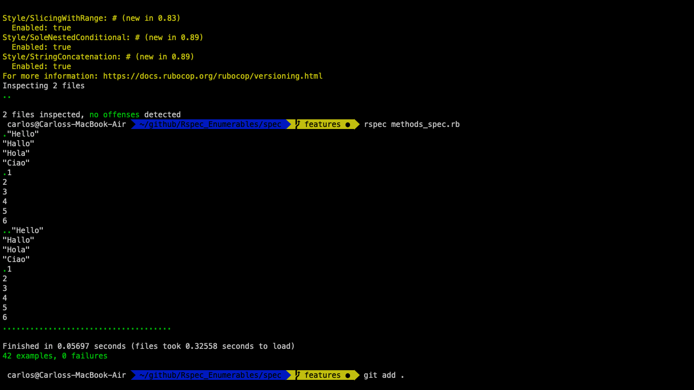

# Testing Your Ruby Code - Enumerable

This project was 100% built with Ruby. Created Enumerables class methods. Also worked on how to create methods inside classes.

This is the list of the methods that we created:

```
my_each
my_each_with_index
my_select
my_all?
my_any?
my_none?
my_count
my_map
my_inject
multiply_els
```

## 🔧 Built With

- Ruby.
- Using Rubocop Linters.

## Running tests with Rspec

This methods were tested with Rspec wich is a computer domain-specific language (DSL) testing tool written in programming language Ruby to test Ruby code. It is a behavior-driven development (BDD) framework which is extensively used in production applications.

## How to get Rspec running

- In the terminal, type `gem install rspec`
- Once done, go to project directory and type `rspec --init`
- You will see a folder `spec` and a file `.rspec`
- Inside spec folder you'll see a `spec_helper.rb` file.
- In the terminal, type `rspec`

## Rspec output


## 🛠 Getting Started

## Install 
You can run these functions in you own local environment. In order to run, you need to install Ruby in your computer. For windows you can go to [Ruby installer](https://rubyinstaller.org/) and for MAC and LINUX you can go to [Ruby official site](https://www.ruby-lang.org/en/downloads/) for intructions on how to intall it. Then you can clone the project by typing ```https://github.com/carlos-ssh/ruby-enumerables.git```

To get a local copy up and running follow these simple example steps.

- Go to the main page of te repo.
- Press the "Code" button and get the repo link.
- Clone it using git.

# Authors

👤 Carlos Flores Robles
- Github: [@carlos-ssh](https://github.com/carlos-ssh)
- Twitter: [@aom.robles](https://twitter.com/aom.robles)
- Linkedin: [linkedin](https://www.linkedin.com/in/carlos-ssh/)

### 🤝 Contributing
Contributions, issues and feature requests are welcome!

Feel free to check the issues page <a href="https://github.com/bmuhamood/ruby-enumerables/issues">Issues Pages</a>

# Show your support
Give a ⭐️ if you like this project!

### Acknowledgments
- Microverse
- Free Code Camp
- Codecademy
- GitHub
- TheOdinProject
- Ruby

## 📝 License
This project is MIT licensed.
